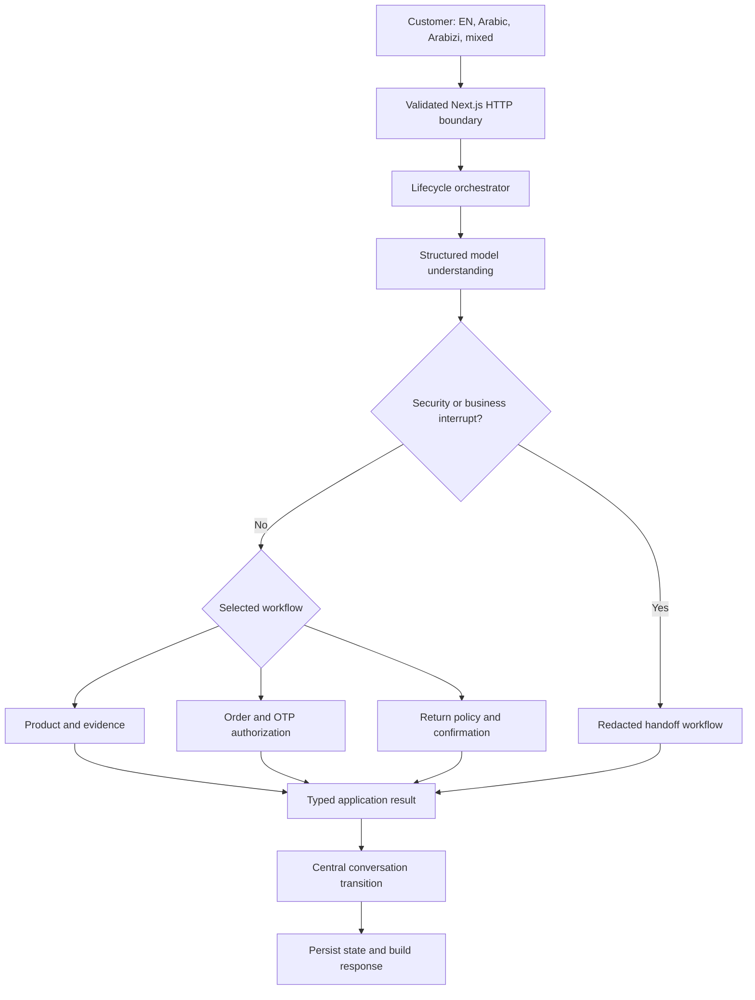

# Solution Design

## Decision

The solution is one tenant-aware Next.js modular monolith. It remains one repository, npm project, process, and deployable unit because the POC needs clear trust boundaries, not distributed infrastructure.

UI and HTTP depend on application coordination; application workflows depend on domain rules and typed ports; server infrastructure implements those ports. `src/core` has no framework, OpenAI SDK, tenant-fixture, or concrete-adapter imports.

## Interaction flow

## Model and application authority

OpenAI structured output is primary for intent understanding, multi-intent decomposition, entity extraction, product reference and follow-up interpretation, acknowledgements and closings, return facts, explicit-human and complaint semantics, refund/cancellation/address-change semantics, language selection, and grounded localized composition. Natural-language messages are interpreted by the model before deterministic workflow selection; application rules never infer ordinary conversational meaning from previous order state.

Application code is authoritative for tenant and conversation binding, tenant-enabled intents, server validation of structured action requests, identifiers, OTP challenge and verification, private-order authorization, typed readiness-to-action mapping, return eligibility, confirmation tokens, idempotency, prohibited automatic actions, evidence eligibility, protected-fact preservation, PII/OTP redaction, handoff routing, persistence, and tool execution.

Narrow deterministic guards reinforce only high-impact boundaries: explicit OTP-bypass attempts, cross-tenant access, private-data disclosure, and OTP recovery. They do not attempt to emulate general multilingual understanding.

## Workflow ownership

- Product owns tenant catalog discovery/search, product clarification, remembered context, variants, unavailable stock, restock abstention, and catalog evidence.
- Order owns order-ID collection, tenant-scoped challenge eligibility, OTP verification, authorized order retrieval, shipment lookup, and verification failures.
- Return owns authorization reuse, delivered-order checks, item selection, independent condition facts, reason capture, deterministic policy, explicit confirmation, idempotent draft creation, cancellation, and duplicate confirmation.
- Handoff owns reason, redacted transcript and summary, attempted resolutions, safe tool history, masked authorized context, urgency, priority, tier, and ticket uniqueness.
- Conversation owns safe deterministic social responses after model classification; they do not rerun tools or mutate a completed workflow.
- The knowledge adapter owns tenant, approval, effective-date, expiration, locale, relevance, citation eligibility, and deterministic filtering of instruction-like content. Retrieved text is treated as untrusted data, not an authority.

All workflow results use one discriminated union: `answered`, `clarification_required`, `action_required`, `handoff_required`, `unavailable`, or `provider_failure`. The OpenAI adapter marks provider errors explicitly; unexpected domain errors are not mislabeled as provider outages. Conversation writes are centralized through focused transition functions that also clear stale authorization and pending transactional capabilities.

## Typed mock integrations and isolation

Typed ports represent commerce, shipping, verification, knowledge, helpdesk, conversation storage, and the assistant model. In-memory adapters simulate MedusaJS-style catalog/order/RMA behavior, Aramex-style tracking, HubSpot-style tickets, OTP, and tenant knowledge.

Both tenants intentionally contain `ORD-1001`. Every port receives tenant context, the conversation store key includes tenant ID, adapters assert tenant identity, and verified access carries the tenant-specific customer identity. Return-draft creation additionally requires the verified customer identity and uses a conversation-scoped idempotency key, so a draft cannot leak across conversations or unverified callers. This demonstrates application-level isolation, not database or infrastructure isolation.

## Privacy and evaluation

OTP uses a dedicated `submit_otp` input and becomes a neutral transcript marker; its value is excluded from model context, audit events, handoffs, and generated evaluation artifacts. Names are masked in tickets, common phone/email/code patterns are redacted, and OpenAI response storage is disabled with `store: false`.

Default tests do not call OpenAI. Integration tests inject explicit model outputs and cover workflows, state, privacy, policy, and tenant boundaries without maintaining a second semantic engine. One route-level smoke test drives Arabizi tracking and OTP through the real `/api/chat` request validation, runtime composition, conversation store, workflows, and response serialization. Browser tests verify only critical UI contracts with stubbed HTTP responses. `tests/model` is the single small, tagged live suite for model understanding and grounded composition.

## Limitations

The POC has in-memory state, synthetic adapters, no production authentication or rate limiting, no durable database isolation, no regional/compliance implementation, and no native Saudi sign-off. It measures controlled scenario behavior, not production reliability or business impact.
