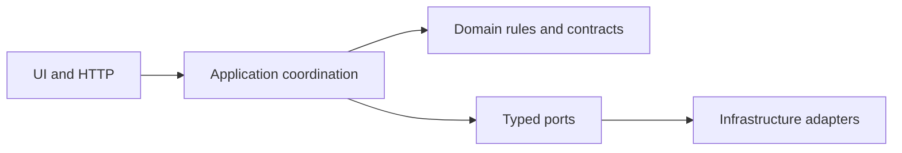

# Architecture

## Dependency direction

`src/app` and reusable `src/components` translate browser and HTTP input. `src/core/orchestrator.ts` owns the request lifecycle. `src/core/orchestration/chat-router.ts` is the single top-level router. It dispatches secure OTP inputs, server-validated structured actions, and model-interpreted messages. A focused selector chooses message workflows; workflow modules use domain rules and typed ports. `src/server` composes OpenAI and synthetic adapters.

Core code imports no Next.js, React, OpenAI SDK, tenant fixtures, Playwright, or concrete infrastructure.

## Module ownership

- `core/orchestrator.ts`: load state, initialize safe context, invoke routing, record the redacted exchange and audit, persist, and construct `ChatResponse`.
- `core/orchestration/chat-router.ts`: message-level model-first flow, authorization-bypass recovery, compound policy+action handling, unsafe-only refusal, global interrupts, deterministic readiness gate, and provider-failure boundary.
- `core/orchestration/server-action-dispatcher.ts`: validates each client action against current server state before dispatch; return confirmation also requires the current capability token.
- `core/orchestration/message-workflow-selector.ts`: phase-aware workflow selection from the model's typed understanding.
- `core/orchestration/pending-intent-coordinator.ts`: reusable selection and resumption of compound product/order requests.
- `core/orchestration/product-routing.ts`: focused product-reference and clarification helpers, including warranty questions that do not require a product reference.
- `core/conversation/transitions.ts`: the only writer of meaningful conversation state and stale-state cleanup.
- `core/workflows/product-workflow.ts`: catalog, product context, variant answers, discovery, clarification, restock/warranty/attribute abstention, and claim-aligned product/policy evidence.
- `core/workflows/order-workflow.ts`: order collection, OTP challenge, verification, safe reuse of tenant-scoped conversation access, bypass recovery, shipment retrieval, and verification failure.
- `core/workflows/return-workflow.ts`: item/facts/reason collection, policy, confirmation capability, idempotent draft, cancellation, and duplicate confirmation.
- `core/workflows/handoff-workflow.ts`: safe payload construction, masked authorized context, routing, and ticket creation.
- `core/returns`, `core/product`, and `core/escalation`: deterministic policy, exact variant matching, and handoff routing.
- `server/openai-assistant-model.ts`: small `AssistantModel` facade over focused OpenAI capabilities.
- `server/openai/structured-output.ts`: provider configuration, structured response parsing, and usage reporting.
- `server/openai/understanding.ts`: thin entry that parses structured understanding and returns the normalized result.
- `server/openai/understanding-schema.ts`: strict schema, including `humanRequestTarget` and `safetyCategory`.
- `server/openai/understanding-prompt.ts`: multilingual classification instructions.
- `server/openai/normalize-understanding.ts`: entity cleanup, safety/human coherence, readiness/intent resolution, and high-confidence boundary reinforcement.
- `server/openai/response-writer.ts`: grounded response composition, protected-fact fallback, and redacted handoff summarization.
- `server/adapters/`: one tenant-scoped in-memory adapter per commerce, shipping, OTP, knowledge, helpdesk, or conversation port.
- `server/runtime.ts`: the composition root.
- `components/support-console.tsx`: page composition only.
- `components/conversation-panel.tsx` and `support-header.tsx`: reusable chat presentation backed by `use-support-conversation.ts`.
- `components/workspace-inspector.tsx`: drawer shell; focused tenant and decision panels expose registered tenant data and operational AI/server decisions.

Understanding also emits structured `humanRequestTarget` and `safetyCategory` fields. Application normalization coerces coherence: imperative “show/print/give/create” demands are not treated as human requests, cross-conversation verification claims become authorization bypasses, and warranty questions stay warranty questions rather than catalog discovery.

## Conversation transitions

State preserves only information needed for the next safe action: active/last intent, response language, product context, pending clarification/intents, verified access, selected order/item, independent return facts, pending confirmation, separate verification and self-service failure counts, redacted transcript, and safe audit history.

Focused transition functions own initialization, language selection, transcript/audit append, workflow switching, clarification, pending intents, product context, verification, return facts, item selection, confirmation, completion, cancellation, and handoff cleanup.

Switching to an incompatible workflow clears authorization, selected order/item, return context, pending confirmation, clarification, and pending intents. Handoff payload construction may read authorized context before the final handoff transition clears it. Plain-text confirmation cannot consume the structured return capability.

## Trust boundaries

The model owns ordinary semantics: intent, multiple intents, entities, follow-ups, acknowledgements and closings, language, complaint/human meaning, prohibited-action meaning, return facts, and localized grounded wording. Natural-language messages always pass through this semantic boundary before workflow selection. A social reply such as “Thanks” cannot inherit an old order ID and reopen OTP verification; even a repeated legitimate tracking request reuses already verified tenant-scoped access rather than issuing another OTP. Authorization from another conversation is never imported.

Application code owns tenant context, identifiers, OTP, authorization, readiness-to-action mapping, policy, confirmation, idempotency, approved/effective evidence, citation eligibility, redaction, handoff routing, persistence, and execution. If natural response composition changes a protected identifier, ISO date, or number from the grounded draft, the model adapter returns the draft instead.

Evidence selection follows the current response claims. A return-policy topic switch must not carry stale product facts or catalog citations unless the current ask is still about that product.

Narrow guards reinforce OTP bypass recovery, cross-tenant access, private-data disclosure, credential/prompt/tool-output refusal, compound policy+action answers, and payment-dispute priority. They do not form a second NLU engine.

Retrieved knowledge is untrusted data. Only active-tenant, approved, currently effective, relevant documents reach response composition. The model cannot turn document instructions into tool calls.

## Runtime composition

Normal application use constructs `OpenAIAssistantModel`. Missing live configuration returns a controlled 503. Integration tests inject explicit scripted understandings through the same `AssistantModel` port. There is no test-mode semantic engine in production code.

The two synthetic tenants have separate branding, catalogs, policies, orders, shipments, and knowledge. Conversation keys include tenant ID, adapters assert tenant context, and verified access includes the tenant-specific customer.

## Deterministic and live-test separation

- `npm test`: small unit tests for input, privacy, routing, policy, and OpenAI-adapter boundaries.
- `npm run eval`: critical workflows with explicit scripted model results.
- `npm run e2e`: UI contracts with HTTP responses stubbed at the browser boundary.
- `npm run eval:model`: the only live OpenAI suite; a tagged registry run sequentially with provider usage reporting.

Each behavior has one primary test level. Generated traces, reports, screenshots, and local cost ledgers are ignored.
